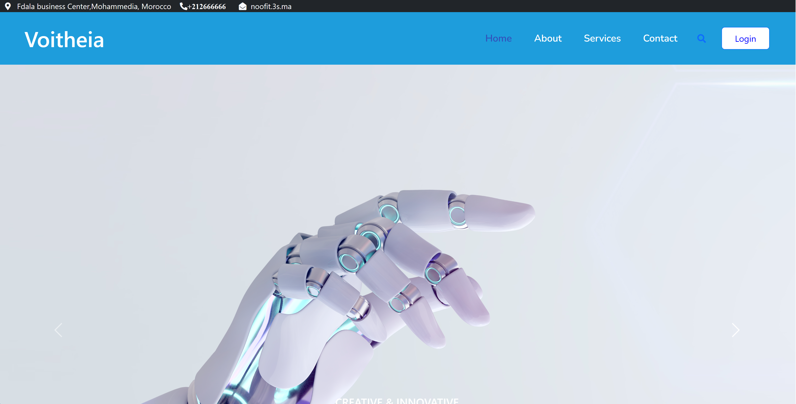
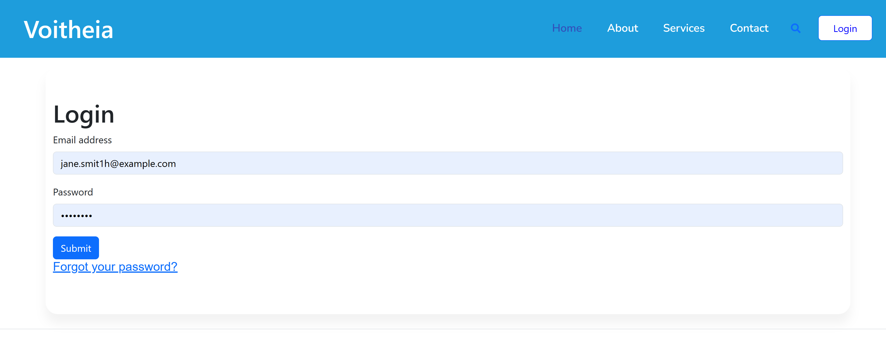
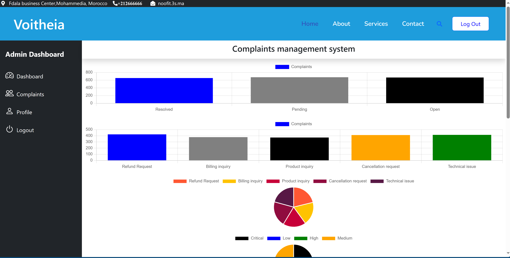

# Complaint Manager (PERN-Stack)

## Project Structure

- **Complaint (Frontend)**: Handles the user interface for the application.
- **Backend**:
  - **Server**: Manages the API, database, and server-side logic.
  - **Predict**: Contains logic for prediction tasks .

## Prerequisites
To run this project, you need to have the following installed:

- **Node.js**: [Download Node.js](https://nodejs.org/)
- **PostgreSQL**: [Download PostgreSQL](https://www.postgresql.org/)
- **Git**: [Download Git](https://git-scm.com/)
- **React**: Ensure you have React installed (usually included with the frontend setup).
- **Express.js**: Ensure you have Express.js installed (usually included with the backend setup).
- **PCA Model**: The PCA model (`pca_model.pkl`) is stored in Google Drive. You need to download it from this [link](https://drive.google.com/file/d/18d9KElvbuKRUmOQJGRCycKdSu9ogYYE1/view?usp=sharing) and place it in the `predict` folder.

## Installation

1. Clone the repository:

    ```bash
    git clone https://github.com/your-repo/project-name.git
    ```

2. Install dependencies for the backend:

    ```bash
    cd backend/server
    npm install
    ```

3. Install dependencies for the frontend:

    ```bash
    cd ../../complaint
    npm install
    ```

4. Download and place the PCA model:
    - Download the `pca_model.pkl` file from Google Drive.
    - Place it in the `backend/predict` folder.

## Running the Project

1. **Backend**: Start the server by navigating to the server folder:

    ```bash
    cd backend/server
    npm start
    ```

2. **Frontend**: Start the frontend by navigating to the complaint folder:

    ```bash
    cd ../../complaint
    npm start
    ```

3. Open your browser and visit [http://localhost:3000](http://localhost:3000).

## Screenshots
## Screenshots

### Main Page


### Login Page


### Dashboard Page


### Add a New Complaint Page


*The complaint is collected automatically ( Not handled in this shared repo), but you can also add it manually.*


